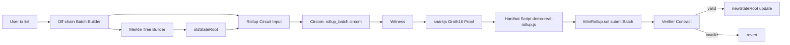
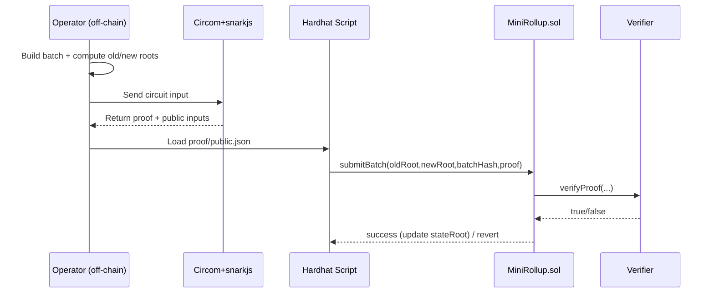

# zkrollup

A mini zkRollup prototype that demonstrates zk-SNARK-based token batch proving and on-chain verification.

Language:
- English: `README.en.md`
- Tiếng Việt: `README.vi.md`

This root README is the English default.

## Overview

This repository has two main parts:

- `mini-zkrollup/`: core source code (contracts, circuits, scripts, tests).
- `mini_zkrollup_plan.md`: project planning notes.

Operational goal:
- build off-chain batch transaction data,
- generate proofs with Circom/snarkjs,
- verify proofs in Solidity,
- update on-chain `stateRoot`.

## Main folder structure

- `mini-zkrollup/contracts/`: Solidity smart contracts.
- `mini-zkrollup/circuits/`: Circom circuits for transfer/batch.
- `mini-zkrollup/scripts/`: Node.js scripts for input/proof/demo/deploy.
- `mini-zkrollup/test/`: Hardhat tests.
- `mini-zkrollup/build/`: circuit artifacts, `ptau`, `zkey`, `r1cs`.
- `mini-zkrollup/output/`: generated proof + public inputs.

## Runtime flow

1. Install dependencies in `mini-zkrollup/`.
2. Generate batch data and rollup circuit input.
3. Compile circuits and run Groth16 setup.
4. Generate proof off-chain.
5. Submit proof to `MiniRollup.sol` for verifier checks.
6. If valid -> update `newStateRoot`; if invalid -> revert.

## Run checklist

- [ ] `cd mini-zkrollup`
- [ ] `npm install`
- [ ] `npm test`
- [ ] `npm run generate:batch`
- [ ] `npm run generate:rollup-input`
- [ ] `npm run compile:rollup-circuit`
- [ ] `npm run setup:rollup-zk`
- [ ] `npm run generate:rollup-proof`
- [ ] `npm run demo:real-rollup`

## System flow diagram

For learning prerequisites and study roadmap, see `mini-zkrollup/README.en.md` or `mini-zkrollup/README.vi.md`.
