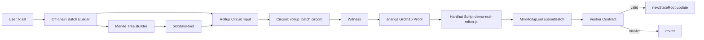
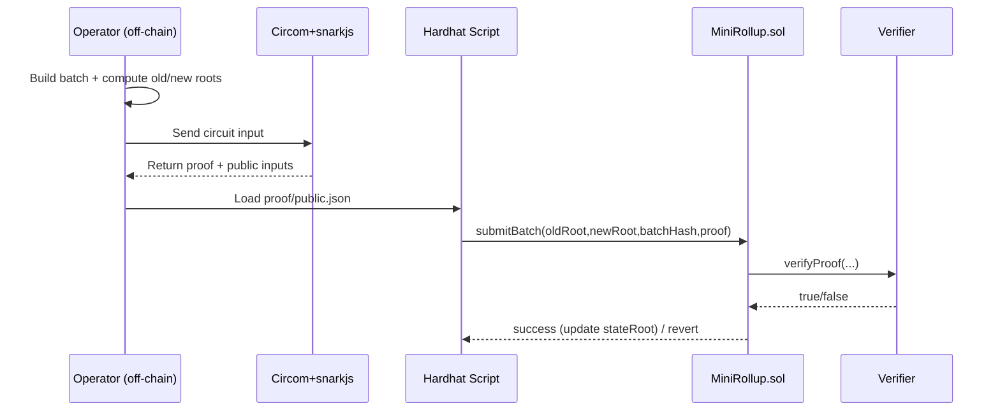

# zkrollup

Dự án này là một prototype mini cho zkRollup, mô tả luồng dùng zk-SNARKs để chứng minh batch giao dịch token và verify proof on-chain.

Ngôn ngữ:
- English: `README.en.md`
- Tiếng Việt: `README.vi.md`

README gốc này đang để mặc định tiếng Anh ở `README.md`; bản này là tiếng Việt.

## Tổng quan

Repo gồm hai phần chính:

- `mini-zkrollup/`: source chính (contracts, circuits, scripts, tests).
- `mini_zkrollup_plan.md`: kế hoạch và ghi chú triển khai.

Mục tiêu vận hành:
- tạo dữ liệu giao dịch off-chain,
- sinh proof với Circom/snarkjs,
- verify proof trong Solidity,
- cập nhật `stateRoot` mới trên chain.

## Cấu trúc thư mục chính

- `mini-zkrollup/contracts/`: smart contracts Solidity.
- `mini-zkrollup/circuits/`: circuits Circom cho transfer/batch.
- `mini-zkrollup/scripts/`: scripts Node.js cho generate input/proof/demo/deploy.
- `mini-zkrollup/test/`: test Hardhat.
- `mini-zkrollup/build/`: artifacts circuit, `ptau`, `zkey`, `r1cs`.
- `mini-zkrollup/output/`: proof + public inputs sinh ra.

## Luồng vận hành

1. Cài dependencies trong `mini-zkrollup/`.
2. Generate batch data và input cho rollup circuit.
3. Compile circuit + setup Groth16.
4. Generate proof off-chain.
5. Submit proof lên `MiniRollup.sol` để verifier kiểm tra.
6. Nếu valid -> cập nhật `newStateRoot`; nếu invalid -> revert.

## Checklist vận hành

- [ ] `cd mini-zkrollup`
- [ ] `npm install`
- [ ] `npm test`
- [ ] `npm run generate:batch`
- [ ] `npm run generate:rollup-input`
- [ ] `npm run compile:rollup-circuit`
- [ ] `npm run setup:rollup-zk`
- [ ] `npm run generate:rollup-proof`
- [ ] `npm run demo:real-rollup`

## Diagram luồng hệ thống

Phần “cần học gì” nằm trong `mini-zkrollup/README.vi.md`.
