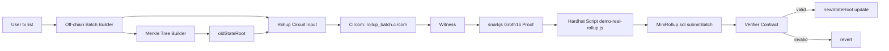
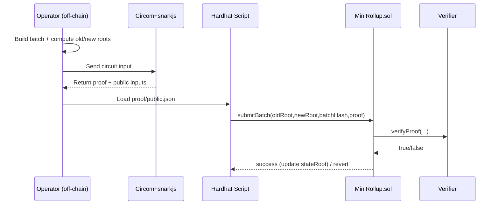

# Mini zkRollup

A small zkRollup prototype that simulates token transfer flow with zero-knowledge proofs.

Language:
- English (default): `README.md`
- Tiếng Việt: `README.vi.md`

## Goal

This project helps you understand:

- Small zkRollup architecture: state root, batch, proof.
- Off-chain proof generation with Circom and snarkjs.
- On-chain verification in Solidity.
- Hardhat workflow for compile/deploy/test/scripts.

## Requirements

- Node.js 18+ (or compatible with packages in `package.json`)
- npm
- Hardhat
- Circom 2 (if compiling circuits directly)
- snarkjs

> Tip: if Circom is not installed yet, you can still run the `MockVerifier` demo to understand contract flow.

## Folder structure

- `contracts/`
  - `MiniRollup.sol`: main contract storing `stateRoot`, receiving proof, and updating state.
  - `MockVerifier.sol`: mock verifier for fast demos.
  - `RollupVerifier.sol`: real Groth16 verifier generated by snarkjs.
  - `RollupVerifierAdapter.sol`: adapter used by `MiniRollup` to call the real verifier.
  - `TransferVerifier.sol`: standalone verifier for transfer circuit.
- `circuits/`
  - `transfer.circom`: validates a single transfer.
  - `rollup_batch.circom`: proves a 2-transfer batch and state transition (`oldStateRoot`, `newStateRoot`, `batchHash`).
  - `batch_with_roots.circom`: extra Merkle path reference.
- `scripts/`
  - `generate-batch.js`, `generate-rollup-input.js`
  - `compile-circuit.js`, `compile-rollup-circuit.js`
  - `setup-zk.js`, `setup-rollup-zk.js`
  - `generate-proof.js`, `generate-rollup-proof.js`
  - `demo.js`, `demo-real-rollup.js`, `deploy.js`, `submit-batch.js`
- `test/`: Hardhat test suite.
- `build/`: artifacts, `ptau`, `zkey`, `r1cs`.
- `output/`: generated proof and public inputs.

## Main runtime flow

1. Build off-chain inputs (`generate-batch.js`, `generate-rollup-input.js`).
2. Compile circuits and run trusted setup (`compile:*`, `setup:*`).
3. Generate proofs off-chain (`generate-proof`, `generate-rollup-proof`).
4. Verify on-chain (`demo` or `demo:real-rollup`).
5. If proof is valid, `MiniRollup.sol` updates `stateRoot`.

## Quick start

```bash
cd mini-zkrollup
npm install
npm run generate:batch
npm test
npm run demo
```

### Run full real-proof flow

```bash
npm run compile:rollup-circuit
npm run setup:rollup-zk
npm run generate:rollup-proof
npm run demo:real-rollup
```

### Deploy local and submit batch

```bash
npx hardhat node
npm run deploy -- --network localhost
npm run submit:batch -- --network localhost
```

## What to learn before reading this source

If you are totally new, follow this order:

1. **Blockchain basics**
   - Account, transaction, gas, state.
   - How contracts persist/update on-chain state.
2. **Solidity basics**
   - `contract`, `mapping`, `event`, `require`, interface.
3. **Hardhat + Node.js workflow**
   - `npm install`, scripts, compile/test/deploy.
4. **Zero-Knowledge Proof fundamentals**
   - Witness, constraints, proving key, verifying key.
   - Groth16: proof + public inputs + verifier contract.
5. **Circom basics**
   - `signal`, `component`, `template`, `===`, `<==`.
6. **circomlib gadgets**
   - `Poseidon`, `Num2Bits`, `IsEqual`, `LessThan`.
7. **Finite field arithmetic**
   - Circuit arithmetic is modulo a finite field.
8. **Merkle tree + Rollup logic**
   - Leaf/root and state root transition over batches.

### Suggested 7-day learning plan

- **Day 1:** Node.js, npm, Hardhat basics.
- **Day 2:** Solidity intro, write one simple contract.
- **Day 3:** ZK/SNARK concepts (no coding yet).
- **Day 4:** Circom syntax + run a tiny circuit.
- **Day 5:** Read and run `transfer.circom`.
- **Day 6:** Read and trace `rollup_batch.circom`.
- **Day 7:** Run full proof + on-chain verification flow.

## Learning and execution checklist

### 1) Foundation checklist

- [ ] Understand blockchain basics: account, tx, gas, state.
- [ ] Read basic Solidity: `contract`, `mapping`, `event`, `require`.
- [ ] Understand Hardhat flow: `compile`, `test`, `deploy`.
- [ ] Understand ZK/SNARK basics: witness, proof, public inputs.
- [ ] Read Circom syntax: `signal`, `template`, `component`, `===`, `<==`.
- [ ] Understand Merkle tree: leaf, root, root update.
- [ ] Understand why Poseidon is used in circuits.

### 2) Technical run checklist

- [ ] `npm install`
- [ ] `npm test`
- [ ] `npm run generate:batch`
- [ ] `npm run generate:rollup-input`
- [ ] `npm run compile:rollup-circuit`
- [ ] `npm run setup:rollup-zk`
- [ ] `npm run generate:rollup-proof`
- [ ] `npm run demo:real-rollup`

### 3) Source reading checklist (recommended order)

- [ ] `contracts/MiniRollup.sol`
- [ ] `circuits/transfer.circom`
- [ ] `circuits/rollup_batch.circom`
- [ ] `scripts/generate-rollup-input.js`
- [ ] `scripts/generate-rollup-proof.js`
- [ ] `scripts/demo-real-rollup.js`
- [ ] `test/real-rollup-proof.test.js`

## System flow diagram




