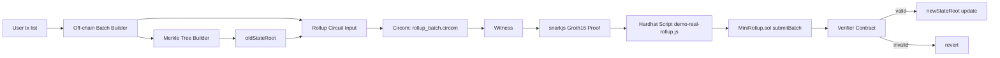
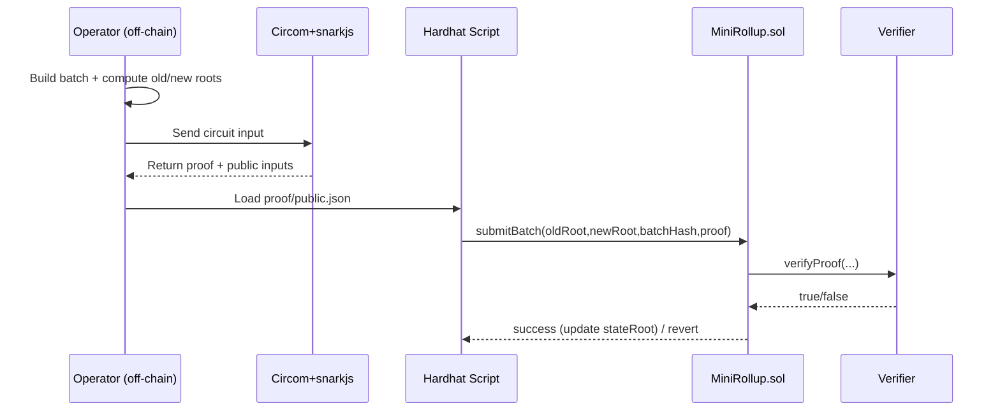

# Mini zkRollup

Prototype zkRollup nhỏ mô phỏng luồng giao dịch token với zero-knowledge proof.

## Mục tiêu

Dự án này giúp bạn hiểu các phần sau:

- Kiến trúc zkRollup nhỏ: state root, batch, proof.
- Off-chain proof generation với Circom và snarkjs.
- On-chain verification trong Solidity.
- Sử dụng Hardhat để biên dịch, deploy, test và chạy script.

## Requirements

- Node.js 18+ (hoặc tương thích với các package trong `package.json`)
- npm
- Hardhat
- Circom 2 (nếu dùng script compile circuit trực tiếp)
- snarkjs

> Gợi ý: nếu chưa cài Circom, bạn vẫn có thể dùng phần demo `MockVerifier` để hiểu luồng contract.

## Kiến thức nên nắm trước

- Solidity cơ bản: contract, state variables, struct, mapping, event.
- Hardhat: project config, script, network local.
- Merkle tree và hash Poseidon.
- zk-SNARKs: circuit, witness, proof, public input, trusted setup.
- Groth16 verification on-chain.

## Cấu trúc thư mục

- `contracts/`
  - `MiniRollup.sol`: contract chính, lưu `stateRoot`, nhận proof và cập nhật trạng thái.
  - `MockVerifier.sol`: verifier giả dùng trong demo nhanh.
  - `RollupVerifier.sol`: verifier Groth16 thật do snarkjs generate.
  - `RollupVerifierAdapter.sol`: adapter giúp `MiniRollup` gọi verifier thật.
  - `TransferVerifier.sol`: verifier riêng cho circuit chuyển token.

- `circuits/`
  - `transfer.circom`: circuit kiểm tra 1 giao dịch token.
  - `rollup_batch.circom`: circuit batch chứng minh 2 giao dịch và cập nhật `oldStateRoot`, `newStateRoot`, `batchHash`.
  - `batch_with_roots.circom`: tham khảo Merkle path chi tiết hơn, làm mẫu thêm.

- `scripts/`
  - `generate-batch.js`: tạo batch dữ liệu và Merkle tree demo.
  - `generate-rollup-input.js`: sinh input cho circuit rollup từ batch.
  - `compile-circuit.js`, `compile- rollup-circuit.js`: compile circuit bằng circom.
  - `setup-zk.js`, `setup-rollup-zk.js`: thực hiện trusted setup (`ptau`, `zkey`).
  - `generate-proof.js`, `generate-rollup-proof.js`: tạo witness và proof bằng snarkjs.
  - `demo.js`: chạy flow on-chain với `MockVerifier`.
  - `demo-real-rollup.js`: chạy flow on-chain với proof Groth16 thật.
  - `deploy.js`: deploy contract tá»›i local network.
  - `submit-batch.js`: submit batch lên contract đã deploy.
  - `verify-transfer-onchain.js`: verify proof transfer trên blockchain.

- `test/`: test suite Hardhat.
- `build/`: chứa artifacts, ptau, zkey, r1cs.
- `output/`: chứa proof, public input, and other generated files.
- `artifacts/`: Hardhat compile output.

## Luồng hoạt động chính

### 1. Tạo dữ liệu input off-chain

- `generate-batch.js`: tạo batch dữ liệu demo và Merkle tree.
- `generate-rollup-input.js`: tạo input phù hợp cho circuit batch.

### 2. Compile circuit và chuẩn bị trusted setup

- `compile:circuit`: compile `transfer.circom`.
- `compile:rollup-circuit`: compile `rollup_batch.circom`.
- `setup:zk`: tạo `ptau` và `zkey` cho circuit transfer.
- `setup:rollup-zk`: tạo `ptau` và `zkey` cho circuit batch.

### 3. Sinh proof off-chain

- `generate-proof`: tạo proof cho `transfer.circom`.
- `generate-rollup-proof`: tạo proof cho `rollup_batch.circom`.

Kết quả nằm trong `output/` và `build/`.

### 4. Verify proof on-chain

- `demo.js`: chạy contract với `MockVerifier` để kiểm tra luồng logic.
- `demo-real-rollup.js`: verify proof thật và cập nhật `stateRoot`.
- `verify-transfer-onchain.js`: kiểm tra proof transfer trên chain.

### 5. Cập nhật state root

- Nếu proof hợp lệ, `MiniRollup.sol` cập nhật `stateRoot` mới.
- Contract chỉ chấp nhận batch khi `oldStateRoot` và `newStateRoot` khớp input public.

## Start nhanh

```bash
cd mini-zkrollup
npm install
npm run generate:batch
npm test
npm run demo
```

### Chạy toàn bộ proof thật

```bash
npm run compile:rollup-circuit
npm run setup:rollup-zk
npm run generate:rollup-proof
npm run demo:real-rollup
```

### Deploy local và submit batch

```bash
npx hardhat node
npm run deploy -- --network localhost
npm run submit:batch -- --network localhost
```

## Hướng đọc source đề xuất

1. `contracts/MiniRollup.sol` để hiểu core state và verification flow.
2. `contracts/MockVerifier.sol` để hiểu mock verification.
3. `circuits/rollup_batch.circom` để hiểu logic proof batch.
4. `scripts/generate-rollup-input.js` và `generate-rollup-proof.js` để biết input và proof flow.
5. `scripts/demo-real-rollup.js` để hiểu cách proof on-chain thực sự.

## Lưu ý

- `npm run demo` dùng `MockVerifier` nên chạy nhanh và dễ debug.
- `npm run demo:real-rollup` chạy proof thật, có thể chậm hơn vì snarkjs và trusted setup.
- Các file `output/public.json` và `output/proof.json` là kết quả đầu ra quan trọng để verify.

## Nếu muốn hiểu sâu hơn

- Mở `mini-zkrollup/lib/merkle.js` và `lib/poseidon.js` để xem cách tính hash và Merkle tree.
- Xem `batch_with_roots.circom` như mẫu để mở rộng circuit Merkle path.
- Đọc test `test/mini-rollup.test.js` và `test/real-rollup-proof.test.js` để hiểu kỳ vọng của contract.

## Bạn cần học gì trước khi đọc source này

Nếu bạn là người mới hoàn toàn, nên học theo thứ tự sau để hiểu nhanh nhất:

1. **Blockchain căn bản**
   - Account, transaction, gas, state.
   - Cách contract lưu và cập nhật trạng thái on-chain.

2. **Solidity cơ bản**
   - Cú pháp contract, `mapping`, `event`, `require`, interface.
   - Cách đọc các file trong `contracts/` (đặc biệt `MiniRollup.sol`).

3. **Hardhat + Node.js workflow**
   - `npm install`, chạy script, compile/test/deploy.
   - Hiểu `package.json`, `hardhat.config.js`, thư mục `artifacts/`.

4. **Zero-Knowledge Proof (mức nhập môn)**
   - Khái niệm witness, constraint, proving key, verifying key.
   - Groth16: proof + public inputs + verifier contract.

5. **Circom cơ bản**
   - `signal`, `component`, `template`, ràng buộc `===`, gán `<==`.
   - Đọc được `circuits/transfer.circom` và `circuits/rollup_batch.circom`.

6. **circomlib gadgets**
   - `Poseidon`, `Num2Bits`, `IsEqual`, `LessThan`.
   - Vì sao hệ này dùng Poseidon thay vì SHA trong circuit.

7. **Finite field arithmetic**
   - Mọi phép toán trong circuit chạy trên trường hữu hạn (mod field).
   - Lý do cần giới hạn bit-size bằng `Num2Bits`.

8. **Merkle tree + Rollup logic**
   - Leaf/root, cách tính root mới sau batch giao dịch.
   - Luồng tổng: `oldStateRoot -> proof -> verify -> newStateRoot`.

### Lộ trình học nhanh 7 ngày (gợi ý)

- **Ngày 1:** Node.js, npm, Hardhat cơ bản.
- **Ngày 2:** Solidity nhập môn, viết 1 contract đơn giản.
- **Ngày 3:** Khái niệm ZK/SNARK (chưa cần code).
- **Ngày 4:** Circom syntax + chạy circuit nhỏ.
- **Ngày 5:** Đọc và chạy `transfer.circom`.
- **Ngày 6:** Đọc và trace `rollup_batch.circom`.
- **Ngày 7:** Chạy full flow proof + verify on-chain trong repo này.

## Checklist học và chạy dự án

### 1) Checklist kiến thức nền

- [ ] Hiểu blockchain cơ bản: account, tx, gas, state.
- [ ] Đọc được Solidity cơ bản: `contract`, `mapping`, `event`, `require`.
- [ ] Biết Hardhat flow: `compile`, `test`, `deploy`.
- [ ] Nắm ZK/SNARK nhập môn: witness, proof, public inputs.
- [ ] Đọc được Circom: `signal`, `template`, `component`, `===`, `<==`.
- [ ] Hiểu Merkle tree: leaf, root, update root.
- [ ] Biết Poseidon hash dùng trong circuit.

### 2) Checklist chạy kỹ thuật

- [ ] `npm install`
- [ ] `npm test`
- [ ] `npm run generate:batch`
- [ ] `npm run generate:rollup-input`
- [ ] `npm run compile:rollup-circuit`
- [ ] `npm run setup:rollup-zk`
- [ ] `npm run generate:rollup-proof`
- [ ] `npm run demo:real-rollup`

### 3) Checklist đọc source theo thứ tự

- [ ] `contracts/MiniRollup.sol`
- [ ] `circuits/transfer.circom`
- [ ] `circuits/rollup_batch.circom`
- [ ] `scripts/generate-rollup-input.js`
- [ ] `scripts/generate-rollup-proof.js`
- [ ] `scripts/demo-real-rollup.js`
- [ ] `test/real-rollup-proof.test.js`

## Diagram luồng hệ thống





