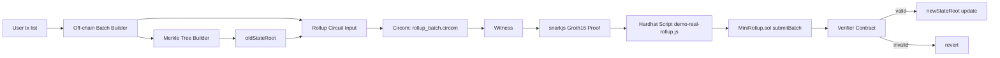
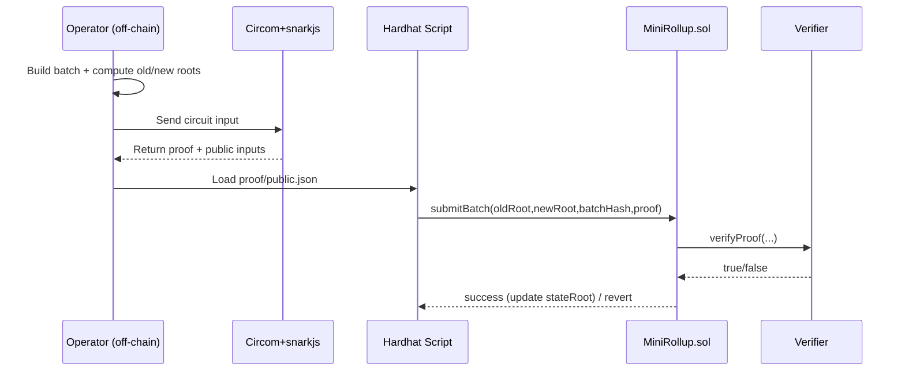

# Mini zkRollup

Prototype zkRollup nhỏ mô phỏng luồng giao dịch token với zero-knowledge proof.

## Mục tiêu

Dự án này giúp bạn hiểu các phần sau:

- Kiến trúc zkRollup nhỏ: state root, batch, proof.
- Off-chain proof generation với Circom và snarkjs.
- On-chain verification trong Solidity.
- Sử dụng Hardhat để biên dịch, deploy, test và chạy script.

## Requirements

- Node.js 18+ (hoặc tương thích với các package trong `package.json`)
- npm
- Hardhat
- Circom 2 (nếu dùng script compile circuit trực tiếp)
- snarkjs

> Gợi ý: nếu chưa cài Circom, bạn vẫn có thể dùng demo `MockVerifier` để hiểu luồng contract.

## Cấu trúc thư mục

- `contracts/`
  - `MiniRollup.sol`: contract chính, lưu `stateRoot`, nhận proof và cập nhật trạng thái.
  - `MockVerifier.sol`: verifier giả dùng trong demo nhanh.
  - `RollupVerifier.sol`: verifier Groth16 thật do snarkjs generate.
  - `RollupVerifierAdapter.sol`: adapter giúp `MiniRollup` gọi verifier thật.
  - `TransferVerifier.sol`: verifier riêng cho circuit chuyển token.
- `circuits/`
  - `transfer.circom`: circuit kiểm tra 1 giao dịch token.
  - `rollup_batch.circom`: circuit batch chứng minh 2 giao dịch và cập nhật `oldStateRoot`, `newStateRoot`, `batchHash`.
  - `batch_with_roots.circom`: tham khảo Merkle path chi tiết hơn.
- `scripts/`
  - `generate-batch.js`, `generate-rollup-input.js`
  - `compile-circuit.js`, `compile-rollup-circuit.js`
  - `setup-zk.js`, `setup-rollup-zk.js`
  - `generate-proof.js`, `generate-rollup-proof.js`
  - `demo.js`, `demo-real-rollup.js`, `deploy.js`, `submit-batch.js`
- `test/`: test suite Hardhat.
- `build/`: artifacts, `ptau`, `zkey`, `r1cs`.
- `output/`: proof và public inputs.

## Luồng hoạt động chính

1. Tạo dữ liệu input off-chain (`generate-batch.js`, `generate-rollup-input.js`).
2. Compile circuit và chuẩn bị trusted setup (`compile:*`, `setup:*`).
3. Sinh proof off-chain (`generate-proof`, `generate-rollup-proof`).
4. Verify proof on-chain (`demo` hoặc `demo:real-rollup`).
5. Nếu proof hợp lệ, `MiniRollup.sol` cập nhật `stateRoot` mới.

## Start nhanh

```bash
cd mini-zkrollup
npm install
npm run generate:batch
npm test
npm run demo
```

### Chạy toàn bộ proof thật

```bash
npm run compile:rollup-circuit
npm run setup:rollup-zk
npm run generate:rollup-proof
npm run demo:real-rollup
```

### Deploy local và submit batch

```bash
npx hardhat node
npm run deploy -- --network localhost
npm run submit:batch -- --network localhost
```

## Bạn cần học gì trước khi đọc source này

Nếu bạn là người mới hoàn toàn, nên học theo thứ tự sau để hiểu nhanh nhất:

1. **Blockchain căn bản**
   - Account, transaction, gas, state.
   - Cách contract lưu và cập nhật trạng thái on-chain.
2. **Solidity cơ bản**
   - Cú pháp contract, `mapping`, `event`, `require`, interface.
3. **Hardhat + Node.js workflow**
   - `npm install`, chạy script, compile/test/deploy.
4. **Zero-Knowledge Proof (mức nhập môn)**
   - Witness, constraint, proving key, verifying key.
   - Groth16: proof + public inputs + verifier contract.
5. **Circom cơ bản**
   - `signal`, `component`, `template`, `===`, `<==`.
6. **circomlib gadgets**
   - `Poseidon`, `Num2Bits`, `IsEqual`, `LessThan`.
7. **Finite field arithmetic**
   - Phép toán circuit chạy trên trường hữu hạn (mod field).
8. **Merkle tree + Rollup logic**
   - Leaf/root, cách tính root mới sau batch giao dịch.

### Lộ trình học nhanh 7 ngày (gợi ý)

- **Ngày 1:** Node.js, npm, Hardhat cơ bản.
- **Ngày 2:** Solidity nhập môn, viết 1 contract đơn giản.
- **Ngày 3:** Khái niệm ZK/SNARK (chưa cần code).
- **Ngày 4:** Circom syntax + chạy circuit nhỏ.
- **Ngày 5:** Đọc và chạy `transfer.circom`.
- **Ngày 6:** Đọc và trace `rollup_batch.circom`.
- **Ngày 7:** Chạy full flow proof + verify on-chain.

## Checklist học và chạy dự án

### 1) Checklist kiến thức nền

- [ ] Hiểu blockchain cơ bản: account, tx, gas, state.
- [ ] Đọc được Solidity cơ bản: `contract`, `mapping`, `event`, `require`.
- [ ] Biết Hardhat flow: `compile`, `test`, `deploy`.
- [ ] Nắm ZK/SNARK nhập môn: witness, proof, public inputs.
- [ ] Đọc được Circom: `signal`, `template`, `component`, `===`, `<==`.
- [ ] Hiểu Merkle tree: leaf, root, update root.
- [ ] Biết Poseidon hash dùng trong circuit.

### 2) Checklist chạy kỹ thuật

- [ ] `npm install`
- [ ] `npm test`
- [ ] `npm run generate:batch`
- [ ] `npm run generate:rollup-input`
- [ ] `npm run compile:rollup-circuit`
- [ ] `npm run setup:rollup-zk`
- [ ] `npm run generate:rollup-proof`
- [ ] `npm run demo:real-rollup`

### 3) Checklist đọc source theo thứ tự

- [ ] `contracts/MiniRollup.sol`
- [ ] `circuits/transfer.circom`
- [ ] `circuits/rollup_batch.circom`
- [ ] `scripts/generate-rollup-input.js`
- [ ] `scripts/generate-rollup-proof.js`
- [ ] `scripts/demo-real-rollup.js`
- [ ] `test/real-rollup-proof.test.js`

## Diagram luồng hệ thống




